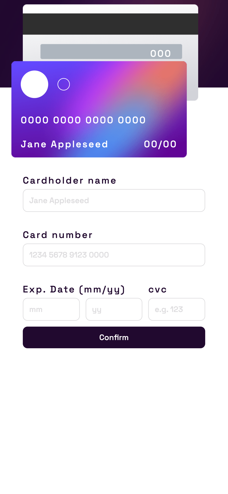
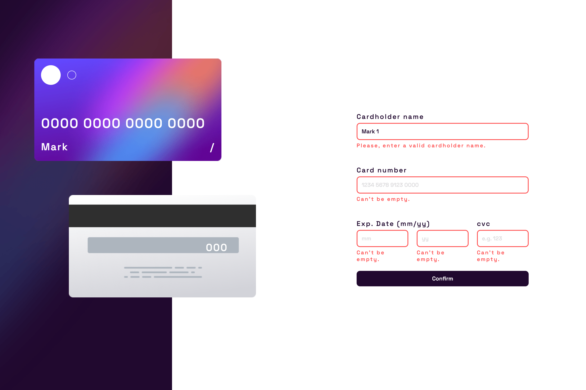

# Interactive Card

A project developed to pratice jQuery. Interactive Card allows you to enter your card info while validating it simultaneously. When the information is valid, it is automatically added to the card. When all fields are properly filled, and the "Confirm" button is clicked, a confirmation page is displayed. The design of the Interactive Card is created by [FrontEnd Mentor](https://www.frontendmentor.io/challenges/interactive-card-details-form-XpS8cKZDWw).

### You can access Interactive Card [here](https://validationcard.netlify.app).

## Responsive Design

## Simultaneous Validation

## Confirmation Page

## Development Process

- Downloading the files from FrontEnd Mentor;
- Setting up the project starting files;
- Creating a diagram with the logic for the form validation;
- Making the HTML structure;
- Creating modular components and the necessary input object;
- Adding the components dynamically into the DOM;
- Styling the page elements and components from a mobile-first workflow;
- Creating a function to validate the inputs;
- Testing the validation;
- Creating a function to insert the input values into the card;
- Testing the application of the inputs into the card;
- Creating functions to apply and to remove the validation style;
- Testing the validation style;
- Creating a function to split the card number into four parts with a space in between;
- Testing the display of the card number;
- Creating a function to remove the form for the confirmation page; 
- Creating the components for the confirmation page;
- Testing the project.

## Built with

- Semantic HTML5 markup;
- JavaScript;
- jQuery;
- Mobile-first workflow;

## Technologies and Tools

- [HTML5](https://html.com)
- [CSS3](https://www.w3.org/Style/CSS/)
- [JavaScript](https://www.javascript.com)
- [jQuery](https://jquery.com)

## Requirements

To work with the code, you will need, before you begin, to install on your machine Git and to have a source-code editor such as [VSCode](https://code.visualstudio.com).

## What I Learned

### Creating elements with jQuery:

- This is my second project using jQuery. The [first project](https://github.com/CarolANikolic/jQuery), was a compilation of my study about jQuery, but Interactive Card is an actual real-life project of form validation. I've noticed how shorter the is code using jQuery instead of JS.

~~~
const Form = (inputArray) => {
    const form = $('<form>');
    const allInputsContainer = $('
');
~~~

### Manipulating attributes with jQuery:
- Dynamically adding or manipulating attributes is also shorter.

~~~
const IconOrImage = (source, alternative, style) => {
    const iconOrImage = $("");
    iconOrImage.attr("src", source);
    iconOrImage.attr("alt", alternative);
    iconOrImage.addClass(style)

    return iconOrImage
}

export default IconOrImage
~~~

### Collection Iteration  with jQuery & Conversion of elements :
- In comparison with JS forEach, the jQuery each() method can be used to iterate over items of an array or a collection of DOM elements, while forEach is used to iterate over arrays. The syntax is also different, with the each() the first argument of the callback function is the index, while the forEach first argument is the value.

~~~
 inputArray.each((i, input) => {
        const inputValue = $(input).val();
        const inputValidationExpression = objectArray[i].validation;
        const validationErrorMessage = objectArray[i].validationMessage;
        const inputContainer = $(input).parent();
        const inputKeyword = objectArray[i].keyword;
~~~

- Bellow, the code snippet adds a $() on the input, the value of our callback function. The reason is that without the $(), the input is a regular JS DOM element, and since we are working with jQuery and getting the value of it, we need to convert this JS element into a jQuery object.

~~~
 inputArray.each((i, input) => {
        const inputValue = $(input).val();
~~~

### Made with :heart: by [Caroline Almeida Nikolic](https://www.linkedin.com/in/carolinealmeidanikolic/)